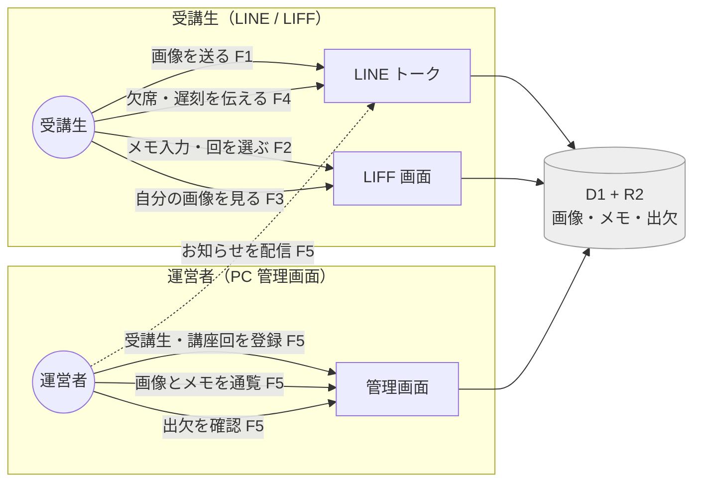
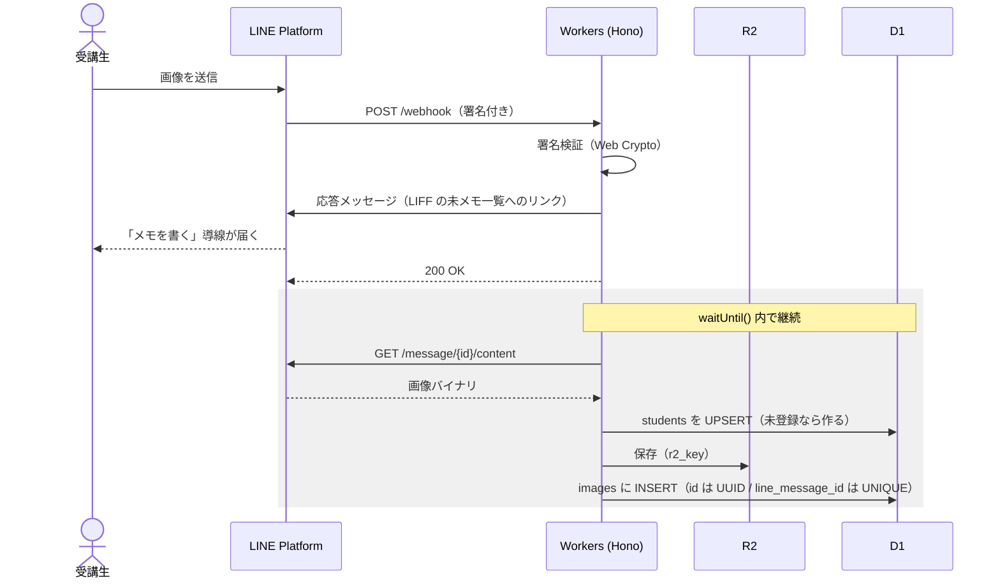
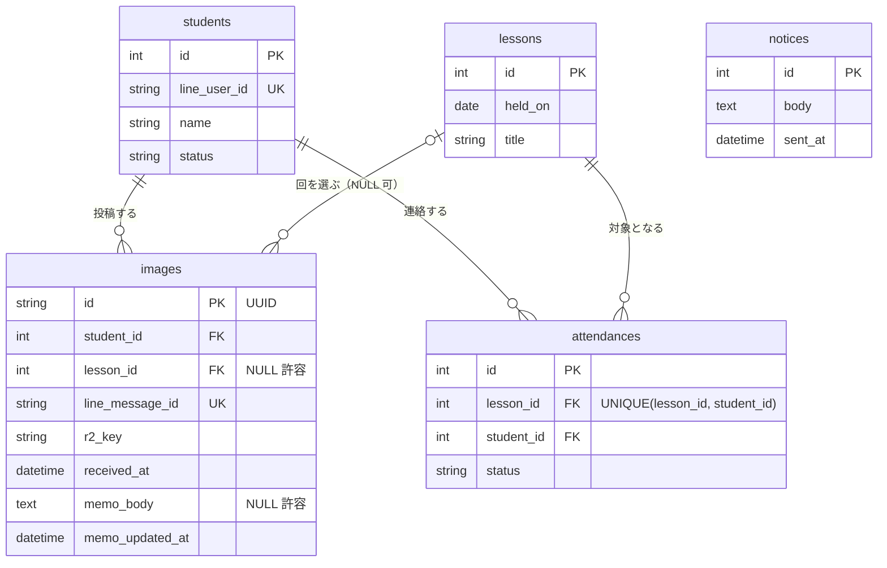

# 講座運営アプリ（個人開発）設計書

- 作成日: 2026-09-12
- 位置づけ: 個人開発。発注者は存在しない
- 主目的: Hono / Cloudflare スタックの習得
- 題材: 講座の運営

## 1. この文書の前提

実クライアントはいない。要件は自分で決めてよく、迷ったら習得目的に沿うほうを選ぶ。

判断基準の優先順位は次のとおり。

1. Hono / Cloudflare の主要機能に触れられるか
2. 作り切れるか（機能を増やして未完で終わらせない）
3. 題材としての自然さ

3 は最下位に置く。実在の講座を運営するわけではないので、業務的な正しさより技術的な学びを取る。

要件と設計を別の文書に分けない。合意する相手がいないため分ける利点がなく、むしろ外部サービスの制約が要件を書き換える場面（F1 の応答トークンなど）で、同じ文書にあるほうが追随しやすい。4 章までが何を作るか、5 章以降が実装方針にあたる。

## 2. 習得対象

このアプリで触れることを目的とする技術要素。

| 要素 | 何に使うか |
| --- | --- |
| Hono | ルーティング、ミドルウェア、JSX によるサーバーサイド HTML |
| Cloudflare Workers | 実行環境 |
| D1 | 受講生・画像・メモ・出欠のデータ |
| R2 | 投稿画像の保存 |
| LINE Messaging API | Webhook で投稿画像とメッセージを受信 |
| LIFF | LINE 内で開く画面（メモ入力・画像一覧） |

React は使わない。管理画面も LIFF 画面もサーバーサイド HTML で組み、JS は LIFF の初期化など必要最小限にとどめる。依存を薄く保つこと自体を設計方針とする。

言語は TypeScript。`wrangler types` でバインディングの型定義を生成し、`c.env` から D1 / R2 に型付きでアクセスする。LINE の Webhook イベント型は `@line/bot-sdk` から `import type` で型だけ借りる（SDK 本体は Node 依存があるため、API は fetch で直接叩く）。

### フレームワーク選定の確認（2026-09-12）

Hono 以外の選択肢も検討したうえで、Hono を採用する。

| 候補 | 判断 |
| --- | --- |
| Hono | 採用。JSX 同梱で追加依存ゼロ、バインディングの型付け、14KB と軽量 |
| 素の fetch ハンドラ | ルーティングと署名検証を自前で書くことになり、手間の割に学びが増えない |
| Elysia / itty-router | Elysia は Bun 前提で Workers が主戦場ではない。itty-router は JSX もミドルウェアもなく自作が増える |
| Next.js / Remix | React 前提。「React は使わない」と衝突し、構成も重い |
| Go / Rust (WASM) | バインディングの取り回しが JS より面倒で、習得対象が Cloudflare なら遠回り |

「サーバーサイド HTML・依存を薄く」という方針の下では、Hono の弱点とされる大規模構成の話が表面化せず、強みだけが効く。

## 3. 登場するロール

| ロール | 実体 | 入口 |
| --- | --- | --- |
| 受講生 | 自分の LINE アカウントでテストする | LINE / LIFF |
| 運営者 | 自分 | PC ブラウザの管理画面 |

実運用ではないため、受講生は自分ひとりで兼任してよい。複数人での検証が必要になったら、テスト用アカウントを追加する。



両者は直接やりとりしない。受講生が入れたデータを運営者が管理画面から見る、という一方向の関係になる。逆向きに届くのはお知らせの配信（プッシュ）だけで、これが唯一、運営者から受講生へ能動的に流れる経路。

所見コメントのような相互のやりとりはスコープ外（4 章）。入れると通知の設計と既読管理が要るため、習得目的に対して重すぎる。

## 4. 機能要件

### F1. 画像の受信（LINE Webhook）

- 受講生が LINE のトークに画像を送ると、Webhook で受信する
- 画像を Messaging API 経由で取得し、R2 に保存する
- D1 に画像レコードを作る（送信者の LINE ユーザー ID、保存先キー、受信日時、LINE のメッセージ ID）
- 画像の取得を待たず、その場で「メモを書く」導線（LIFF の未メモ一覧へのリンク）を応答メッセージで返す
- 友だち追加（follow イベント）で受講生を自動登録する
- 画像以外のメッセージには定型文を返す（下記）

習得の主眼は署名検証、バイナリの取得と R2 への保存、Workers 上での非同期処理。

#### 画像以外のメッセージ

`message` イベントは画像だけでなくテキストやスタンプでも飛んでくる。無視すると受講生から見て無反応になるため、`type` で分岐し、画像以外には「画像を送ってください」の定型文を応答メッセージで返す。

応答メッセージなので課金対象外（6 章）。Webhook が生きていることの確認にもなる。F4（出欠連絡）でテキストを扱うようになったら、段階 8 でこの分岐を広げる。

#### 受講生の自動登録

`images.student_id` は `students` の行を前提にするため、未登録のユーザーからの投稿が落ちないようにする。

- follow イベントで `/v2/bot/profile/{userId}` を叩き、表示名込みで `students` に UPSERT する
- message イベント側でも、未登録なら同じ UPSERT を通してから画像の処理に入る

保険を二重に置くのは、follow を取りこぼす経路があるため。デプロイ前から友だちだったユーザーには follow が飛ばない。ブロック解除でも follow は飛ぶが、これは新規ではないので `line_user_id` の UNIQUE で弾かれ、二重登録にならない。

開発を始める時点で自分はすでに友だち追加済みのはずで、follow イベントは飛んでこない。最初の 1 件は手で INSERT するか、一度ブロックして解除する。



応答メッセージを 200 より前に置くのが要。画像の取得と保存は 200 を返した後に続くため、受講生の手元には導線が先に届き、画像は数秒遅れて保存される。

#### 応答メッセージは画像の取得より先に送る

応答トークン（`replyToken`）には制約があり、これが F1 の処理順を決める。

- webhook 受信後 1 分以内に使う必要がある
- 1 回しか使えない
- 時間制限は予告なく変更されうる。ネットワーク遅延で実際の使用可能時間も変わるため、**時間制限に依存した実装をしてはならない。応答トークンはできるだけ早く使うこと**（公式リファレンスの明示的な指示）

画像の取得（数百 KB〜数 MB）と R2 保存を挟んでから応答すると、この指示に反する。実測で 1 分に収まるかどうかの問題ではなく、依存してはいけない前提に依存する設計になる。失効すればプッシュへの切り替えが要り、月 200 通の課金枠を消費する。

そのため応答メッセージは署名検証の直後、200 を返す前に送る。画像の取得と保存は `waitUntil()` に残す。

この順にすると、応答時点ではまだ画像レコードが存在しない。よってリンクに画像 ID は載せられず、**LIFF の「未メモ画像の一覧」へのリンク**にする。複数枚をまとめて送られた場合も、一覧なら全部並ぶので取りこぼさない（イベントは画像ごとに届くため応答も複数回送られるが、どれを押しても同じ一覧に着地する）。

Webhook の再送に備え、`images.line_message_id` に UNIQUE を張って冪等にする。200 を返す前に Workers が落ちた場合、LINE は同じイベントを再送する。R2 への保存は後述の規則でキーを決定的に導出するため、再送時は同じキーを上書きするだけで無害になる。

#### R2 のキーと Content-Type

`r2_key` は `{student_id}/{line_message_id}` とする。拡張子は付けない。

受講生ごとに畳まれるので R2 のコンソールから追いやすく、`line_message_id` が全体で一意なため衝突しない。同じ入力からは必ず同じキーになるので、再送時の上書きが冪等になる。受信日時を含めないのは、再送が月をまたいだときに別キーになり決定性が崩れるため。

Content-Type は D1 に持たず、R2 のオブジェクトメタデータに載せる。LINE から画像を取得した際の応答ヘッダの値を `put()` の `httpMetadata.contentType` に渡し、配信時は `get()` の結果に対して `writeHttpMetadata()` でレスポンスヘッダへ書き戻す。D1 のカラムが増えず、配信経路は R2 だけを見れば完結する。

#### 画像の取得を後回しにできない理由

LINE はユーザー送信コンテンツの保存期間を保証しておらず、「一定期間後に自動削除」としか規定していない。あとでまとめて R2 へ移す設計は取れない。かといって 200 の応答を待たせるわけにもいかないので、`waitUntil()` で 200 の後に継続させる。ここが「Workers 上での非同期処理」の実体になる。

なお Workers 無料枠の CPU 10ms 制限は障害にならない。CPU 時間は計算時間であり、fetch や R2 書き込みの I/O 待ちは含まれないため。

#### 署名検証

`crypto.createHmac` は Workers で使えないので、Web Crypto で書く。`crypto.subtle` の `importKey` と `sign` で HMAC-SHA256 を計算し、比較は Hono の `hono/utils/buffer` にある `timingSafeEqual` を使う（依存を増やさずに済む）。

### F2. メモの入力（LIFF）

- LIFF を初期化し、`liff.getIDToken()` で ID トークンを取得する
- F1 の返信リンクから未メモ画像の一覧に入り、対象の画像を選んで、感情・気づき・考えをテキストで記録する
- 同じ画面で講座回を選ぶ（`lessons` から一覧を引いて `<select>` で出す）。選択結果は `images.lesson_id` に入れる
- 素の form で POST する。クライアント側のフレームワークは使わない
- 後から本人が編集できる（`images.memo_body` の上書き。履歴は残さない）

講座回は受講生が選ぶ。F1 の受信時点では画像がどの回のものか分からず、受信日から推測すると後日提出で誤った回に付く。本人はどの回か知っているので、メモを書くついでに選んでもらうのが最も正確で、画面も増えない。未選択（NULL）も許す。

画像 ID は URL に載るため書き換えられる。保存前に、その画像の `student_id` が LIFF で特定した LINE ユーザー ID と一致するか必ず検証する。F3 の公開範囲（本人と運営者のみ）と同じ判定になる。

#### ID トークンの検証

LINE ユーザー ID は `liff.getProfile()` の結果をそのまま信じてはいけない。クライアント側の値なので POST body に入れれば書き換えられ、他人の ID を名乗れる。所有者の検証が成立しなくなる。

ID トークン（`liff.getIDToken()`）を送り、Workers 側で LINE の検証エンドポイントに投げて確かめる。

```
POST https://api.line.me/oauth2/v2.1/verify
  id_token=<LIFF から受け取った ID トークン>
  client_id=<LINE Login チャネルの ID>
```

`client_id` に渡すのは LINE Login チャネルの ID であって、Webhook で使う Messaging API チャネルの ID ではない。LIFF アプリは LINE Login チャネルにしか追加できないため、この 2 つは別のチャネルになる（段階 4 参照）。取り違えると検証が通らない。

応答の `sub` が検証済みの LINE ユーザー ID になる。この値だけを `students.line_user_id` の照合に使い、クライアントから来た他の値は使わない。検証に失敗したら 401 を返す。

チャネル ID は秘密ではないが、`wrangler.toml` の `vars` に置いて環境ごとに切り替えられるようにする（`LINE_LOGIN_CHANNEL_ID`）。

この検証は LIFF からのリクエストすべてに必要になるため、Hono のミドルウェアとして実装し、F2 と F3 の両方に適用する。検証済みの LINE ユーザー ID は `c.set()` でハンドラへ渡す。

### F3. 画像一覧（LIFF）

- 自分の画像とメモを時系列で表示する
- 未メモのものだけに絞り込めるようにする（`memo_body IS NULL`）。F1 の返信リンクはこの絞り込み状態を指す
- 画像は R2 から配信する。CSS グリッドで並べる
- 画像の URL は `/images/{uuid}` の形にする。R2 は非公開のまま、Workers が読んで返す
- 公開範囲は本人と運営者のみ。他の受講生の画像は見せない

個人開発では公開範囲を検討事項にせず、狭いほうに倒して固定する。実装が単純になり、権限周りの設計に時間を取られない。

画像そのものの配信は UUID の推測困難性に頼り、リクエストごとの認証は行わない。`` タグの GET には ID トークンを載せられないため、都度認証するなら署名付き URL の発行が要る。個人開発では過剰なので、URL を知っている人だけが見られる状態でよしとする。一覧ページ自体（どの画像が誰のものかを返す側）は F2 と同じ ID トークン検証を通し、検証済みの LINE ユーザー ID に紐づく画像だけを返す。

### F4. 出欠連絡（LINE）

- 講座回を管理画面から登録する
- 受講生が LINE のリッチメニューまたはテキストで欠席・遅刻を連絡する
- D1 に記録し、管理画面で回ごとに一覧する

Messaging API のリッチメニューやクイックリプライを試す場として位置づける。優先度は F1〜F3 より低い。

どの回への連絡かをどう特定するかは、ここでは決めない。段階 8 で着手する際に、F2 と同じくクイックリプライで回を選ばせる形に揃えるかを検討する。

### F5. 管理画面（PC）

- 受講生一覧、在籍状態の管理
- 画像とメモの閲覧（受講生ごとの時系列表示、講座回ごとの絞り込み）
- 講座回の登録、出欠一覧
- お知らせの配信（Messaging API のプッシュ送信）

Hono の JSX でサーバーサイド HTML を返す。認証は Cloudflare Access で行う（段階 3 で導入済み）。アプリ側に認証のコードも資格情報も持たず、Worker の手前で弾く。

保護するのは管理画面のパスだけに限る。`/webhook` を保護すると LINE プラットフォームからの POST が認証画面へリダイレクトされて届かなくなり、LIFF 画面と画像配信（`/images/{uuid}`）を保護すると受講生の LINE アプリ内ブラウザから開けなくなる。受講生側の認証は LIFF の ID トークン検証（F2）が担う。

### スコープ外

- 受講料の決済
- 複数講座・複数運営者への対応
- 受講生同士の相互閲覧
- 所見コメント機能

いずれも習得目的に寄与しないか、権限設計を複雑にするだけなので作らない。

## 5. データモデル（案）

D1 のテーブル構成。

| テーブル | 主なカラム |
| --- | --- |
| students | id, line_user_id（UNIQUE）, name, status（受講中／修了）, created_at |
| images | id（UUID）, student_id, lesson_id（NULL 許容）, line_message_id（UNIQUE）, r2_key, received_at, memo_body（NULL 許容）, memo_updated_at |
| lessons | id, held_on, title |
| attendances | id, lesson_id, student_id, status（出席／欠席／遅刻）, note, UNIQUE(lesson_id, student_id) |
| notices | id, body, sent_at |



`notices` はどこにも紐づかない。お知らせは全員宛で、個別の受講生や講座回と関連しないため。

メモは `images` のカラムとして持ち、テーブルを分けない。1 画像に 1 メモで履歴も残さないため、別テーブルにすると JOIN が増えるだけで得るものがない。F2 の「後から編集できる」は `memo_body` の更新で満たす。未記入は NULL で表し、「まだメモを書いていない画像」は `memo_body IS NULL` で引ける。

`images.id` は UUID にする。この値がそのまま画像配信の URL に入るため、連番だと他人の画像を総当たりで引ける。

`images.lesson_id` は F2 のメモ入力時に受講生が選んで入る。F1 の受信時点では NULL で、選ばれなければ NULL のまま残る。集計の基準にはできない前提で扱う。

`images.r2_key` は `{student_id}/{line_message_id}`。画像の MIME タイプは D1 に持たず R2 のメタデータに載せる（F1 参照）。

### 一意制約とインデックス

D1 の行読み取りは返した行数ではなくスキャンした行数で数えられるため、インデックスのないテーブルスキャンが無料枠を消費する唯一の現実的な要因になる。

| 対象 | 種別 | 理由 |
| --- | --- | --- |
| `students.line_user_id` | UNIQUE | Webhook のたびに LINE ユーザー ID で引く。1 人 1 行が保証され、ブロック解除時の二重登録も防げる |
| `images.line_message_id` | UNIQUE | Webhook 再送時の重複 INSERT を弾く（F1） |
| `images.student_id` | INDEX | F3 の一覧、F5 の受講生ごとの表示 |
| `images.lesson_id` | INDEX | F5 の講座回ごとの絞り込み |
| `attendances(lesson_id, student_id)` | UNIQUE | 同じ回への連絡は上書きにする。索引も兼ねる |

`attendances` を UNIQUE にしたのは、「欠席と伝えたあとに遅刻へ訂正する」が自然に UPDATE で表せるため。履歴は残らないが、F5 で見るのは回ごとの最新の状態だけなので足りる。

## 6. 非機能要件

| 項目 | 方針 |
| --- | --- |
| 依存 | ライブラリを増やさない。放置しても壊れにくい構成を保つ |
| 認証 | 受講生は LIFF の ID トークンを Workers 側で検証（F2）、運営者は Cloudflare Access（管理画面のパスのみ） |
| 画像配信 | R2 の内容は Workers 経由でのみ返す。URL に UUID を使い、推測できないようにする |
| コスト | Cloudflare・LINE とも無料枠に収まることを確認済み（下表）。超える設計になったら見直す |
| バックアップ | D1 のエクスポートを手動で取れる状態にしておく |

実運用ではないので可用性と保守性の要件は置かない。

### コストの確認（2026-09-12 時点）

Cloudflare は月額 0 円で収まる。個人利用の規模に対して桁が違う。

| サービス | 無料枠 | 今回の想定 |
| --- | --- | --- |
| Workers | 100,000 リクエスト/日 | 自分と数人。到達しない |
| D1 ストレージ | 5 GB | テキストのみで数 MB |
| D1 行読み取り | 500 万行/日 | 到達しない |
| D1 行書き込み | 100,000 行/日 | 到達しない |
| R2 ストレージ | 10 GB-month | 画像 2 MB × 500 枚で約 1 GB |
| R2 Class A（書き込み） | 100 万リクエスト/月 | 画像保存のみ |
| R2 Class B（読み取り） | 1,000 万リクエスト/月 | 一覧表示のみ |
| R2 下り転送 | 無料 | — |
| Zero Trust（Access） | 50 ユーザー | 運営者 1 人。管理画面の保護に使う |

2026 年 9 月 1 日から、D1 の無料枠超過はエラーで停止する仕様に変わった（以前は超過しても動作した）。超えると `Your account has exceeded D1's free tier daily row read limit.` が返り、UTC 0 時まで復旧しない。5 章のインデックス方針はこれへの備えを兼ねる。

LINE も月額 0 円で収まる。コミュニケーションプラン（0 円）の無料メッセージは月 200 通だが、課金対象は限られる。

| 区分 | 該当するもの |
| --- | --- |
| 課金対象外 | 応答メッセージ（reply token による返信）、Webhook の受信 |
| 課金対象 | プッシュ、マルチキャスト、ブロードキャスト、ナローキャスト |

F1 の返信は応答メッセージなので課金されない。200 通を消費するのは F5 のお知らせ配信（プッシュ）だけで、自分ひとりのテストなら使い切らない。2026 年 10 月 1 日に追加メッセージ料金の改定が予定されているが、これはスタンダードプランの超過分単価の話で、コミュニケーションプランには影響しない。

## 7. 進め方

機能を積む順に並べる。各段階で動く状態にしてから次へ進む。

| 段階 | 内容 | 完了条件 |
| --- | --- | --- |
| 1 | アカウント準備 | LINE 公式アカウントを作成し、Official Account Manager で Messaging API を有効化。チャネルシークレットとチャネルアクセストークンを取得。Cloudflare アカウントを作成 |
| 2 | Hono + Workers の疎通 | ローカルとデプロイ先で Hello World が返る。確定した URL を Webhook URL に登録し、Webhook をオンにする |
| 3 | D1 のスキーマ作成と管理画面の受講生一覧・講座回登録 | 受講生と講座回を登録・一覧できる。デプロイ先でも動き、管理画面は Cloudflare Access で保護されている |
| 4 | LIFF の調査と設定 | 初期化手順を公式ドキュメントで確認し、LIFF アプリを作成してエンドポイント URL を登録。空ページが LINE 内で開く |
| 5 | LINE Webhook で画像を受信し R2 に保存、follow で受講生を自動登録 | トークに送った画像が R2 と D1 に入る。友だち追加で `students` に行ができる。応答メッセージで LIFF へのリンクが届く |
| 6 | LIFF でメモ入力（講座回の選択を含む）と画像一覧、ID トークン検証 | LINE 内で画像を見て、回を選んでメモを書ける。他人の画像 ID を指定すると 401 が返る |
| 7 | 管理画面で画像・メモを通覧 | 受講生ごと・講座回ごとに見られる |
| 8 | 出欠とお知らせ | 余力があれば |

段階 5 と 6 が習得の本体。段階 8 は着手しなくてもよい。

Messaging API チャネルは LINE Developers Console から直接作成できない。先に公式アカウントを作り、Official Account Manager の設定画面で Messaging API を有効化すると、指定したプロバイダーの下にチャネルが生える。チャネルは後からプロバイダー間を移動できないので、有効化時の選択を誤ると作り直しになる。

Webhook の登録を段階 2 に置いたのは、URL が Workers のデプロイまで確定しないため。Official Account Manager の Webhook トグルは Webhook URL を登録するまで操作できず、段階 1 の時点ではオンにできない。

### 段階 2 の実施結果（2026-09-13）

公開 URL は `kouza-app.muso-lab.dev` に固定した。`workers.dev` のままにしなかったのは、Webhook URL が一度 LINE に登録すると変更しにくく、Worker 名の変更に URL が引きずられるため。`wrangler.toml` の `routes` に `custom_domain = true` で書くと、DNS レコードと証明書は wrangler が作る。

この `routes` を明示した副作用で `workers.dev` のルートは無効になる（`workers_dev = true` を書けば併存できる）。併存させず一本に絞ったのは、段階 5 で署名検証を入れるときに入口が複数あると考えることが増えるため。

デプロイは当面、手元から `wrangler deploy` で行う。GitHub 連携の Workers Builds は使わない。段階 5・6 は LINE の実機確認を挟むため、push とビルドを待たずに反映できるほうがループが速い。運用が固まったら切り替えを検討する。

Webhook URL の登録は LINE Developers Console の Messaging API 設定タブで行う。Official Account Manager 側にトグルはあるが URL の入力欄がないため、登録は Console でしかできない。

`/webhook` の実装は段階 5 なので、登録時点では 404 が返る。Console の「検証」ボタンは失敗するが、完了条件は登録とオンまでなので支障はない。経路が通っていることは `wrangler tail` で確認した。LINE からメッセージを送ると `POST https://kouza-app.muso-lab.dev/webhook - Ok` が記録される（`Ok` は Worker が例外なく応答した意味で、HTTP ステータスではない）。

講座回の登録を段階 3 に置いたのは、段階 6 の講座回選択が `lessons` の存在を前提にするため。出欠（F4）は段階 8 のままでよく、ここで作るのは `lessons` の登録と一覧だけ。

段階 3 では受講生の登録画面も作るが、段階 5 で follow による自動登録が入るため、管理画面側の役割は登録より在籍状態の管理と表示名の修正に寄る。段階 5 の着手時、自分自身は友だち追加済みで follow が飛ばない点に注意（F1 参照）。

段階 4 を独立させ、かつ Webhook より前に置いたのは 2 つの理由による。ひとつは、ここだけ調査と外部サービスの設定で、コードを書く作業ではないため。段階 6 で実装しながら調べると、自分のコードの誤りなのか設定の不足なのか切り分けられなくなる。もうひとつは、段階 5 の応答メッセージに LIFF へのリンクを載せるため、LIFF アプリの URL が先に確定している必要があるため。空ページが LINE 内で開くところまでを先に通す。

### 段階 3 の実施結果（2026-09-14）

D1 データベース `kouza-app-db` を APAC リージョンに作成し、バインディング名 `DB` で `wrangler.toml` に登録した。マイグレーションは `migrations/` に置き、`migrations_dir` は既定値と同じなので明示していない。

#### 認証を段階 7 から段階 3 へ前倒しした

当初は認証を段階 7 に置いていたが、段階 3 でデプロイまで通すなら、認証のない管理画面が公開URLに出てしまう。受講生の LINE ユーザー ID と表示名が読める状態になるため、段階 3 の時点で入れた。

Basic 認証ではなく Cloudflare Access を選んだ。アプリ側にコードも資格情報も持たずに済み、Cloudflare の主要機能に触れるという習得目的（1 章の判断基準 1）にも沿う。Basic 認証は認証情報が毎リクエスト平文で飛び、MFA もログアウトもなく、総当たりに対して自前のレート制限が要る。

ID プロバイダーは One-time PIN（メールに届くワンタイム PIN）にした。Google を IdP にすると Google Cloud Platform でのプロジェクト作成と OAuth クライアント作成が要るが、One-time PIN なら設定が不要で、許可はメールアドレスの指定だけで済む。

#### 保護するパスを管理画面に限る

Zero Trust のセルフホストアプリケーションとして、宛先に `kouza-app.muso-lab.dev/admin` と `kouza-app.muso-lab.dev/admin/*` の 2 件を登録した。ポリシーは Action: Allow / Include: Emails で運営者のアドレス 1 件。

2 件に分けたのは、Cloudflare のパス指定では `/admin/*` が `/admin` 自身を覆わないため。`/admin/*` だけを登録すると管理画面のトップが無防備に残る。

Workers ダッシュボードの「Protect this Worker behind Access」は使ってはいけない。Worker に紐づく全ドメイン（routes、Custom Domain、workers.dev、プレビュー）をまとめて保護するため、段階 5 の `/webhook` が 302 で弾かれて Webhook が死ぬ。同じ理由で、宛先のパスを空欄や `/*` にするのも不可。段階 6 の LIFF 画面と画像配信も巻き込む。

ローカル開発（`npm run dev`）は Cloudflare を経由しないため Access が効かない。管理画面の保護はデプロイ先でしか確認できない。

Zero Trust のプランは Free で、50 ユーザーまで無料。自分ひとりなので 0 円に収まる。

#### マイグレーションで 5 テーブルすべてを作る

段階 3 で画面を作るのは `students` と `lessons` だけだが、`images` / `attendances` / `notices` も 1 本目のマイグレーションに含めた。`images` と `attendances` の外部キーが `students` / `lessons` を参照し、SQLite では `ALTER TABLE` で外部キーを後から追加できずテーブル再作成になるため。

#### status は英語で格納する

`students.status` は `enrolled` / `completed`、`attendances.status` は `present` / `absent` / `late` を格納し、CHECK 制約で縛る。5 章の表記は「受講中／修了」「出席／欠席／遅刻」だが、これは画面での表示にあたる。SQL やコード中に日本語リテラルが散るのを避けるため、DB には英語を入れて表示側で和訳する。対訳表は `src/admin/format.ts` の 1 箇所に置く。

CHECK 制約と対訳表は値の集合を一致させる必要がある。片方だけ値を増やすと実行時に CHECK 違反になる。

#### 入力値の検証はアプリ側で行う

HTML の `required` はクライアント側にしか効かず、フォームを介さない POST では素通りする。`NOT NULL` は空文字を弾かない。そのため必須項目の空文字チェックと `status` の値チェックをアプリ側に置き、不正な入力は保存せずエラーを表示して再入力させる。

`lessons.held_on` は形式（`YYYY-MM-DD`）の一致だけでは足りない。`2026-02-30` のような実在しない日付が通ってしまうため、`Date` で UTC 正規化して往復比較し、実在する日付かを確かめる。この値は段階 6 の講座回選択の基準になるので、壊れた日付が入ると後段の並び順と絞り込みが狂う。

#### 段階 5 への申し送り

動作確認のため、本番の `students` にテスト行（`line_user_id` が `Utest-stage3`）を 1 件入れてある。これは LINE の実ユーザー ID ではないので、段階 5 で実 ID の行を作るときに削除する。

F1 に書いたとおり、開発者自身は開発開始時点で友だち追加済みのため follow イベントが飛んでこない。段階 5 では自分の LINE ユーザー ID を持つ行を別途作る必要がある。実 ID は LINE Developers Console か `wrangler tail` で確認できる。

`lessons` に入れた 1 件（`2026-09-20` / 第一回）は段階 6 の講座回選択でそのまま使えるので残す。

### 段階 4 の実施結果（2026-09-14）

#### LIFF アプリには LINE Login チャネルが要る

LIFF アプリは Messaging API チャネルに追加できず、LINE Login チャネルを別に作る必要がある。段階 1 で作った Messaging API チャネルとは別物になるため、チャネルは 2 つになる。

両者は**同じプロバイダーの下に作る**。LINE Login チャネルの基本設定にある「リンクされた LINE 公式アカウント」で、段階 1 の公式アカウントに紐づける。

この影響が出るのは F2 の ID トークン検証で、`client_id` に渡すのは LINE Login チャネルの ID になる。Messaging API チャネルの ID を渡すと検証が通らない。段階 6 で自分のコードを疑う前にここを確かめる。

#### エンドポイント URL は `/liff` に当てる

`https://kouza-app.muso-lab.dev/liff` をエンドポイント URL に登録する。Cloudflare Access の保護対象は `/admin` と `/admin/*` の 2 件だけなので衝突しない。受講生の LINE アプリ内ブラウザから開くパスを Access で保護してはいけない（段階 3 参照）。

サイズは `Full`、スコープは `openid` と `profile` の 2 つを選ぶ。`openid` がないと F2 の ID トークン検証が成立せず、`profile` がないと表示名を取れない。`chat_message.write`（ユーザーの代理でメッセージを送る）は使わないので選ばない。

#### チャネルと LIFF アプリの命名

開発者向けの命名で揃えた。種別が名前から分かることを優先している。

| 対象 | 名前 |
| --- | --- |
| Messaging API チャネル | `kouza-app-channel` |
| LINE Login チャネル | `kouza-app-login` |
| LIFF アプリ | `kouza-app-memo` |

チャネル名と LIFF アプリ名は受講生の目に触れる。チャネル名は初回の同意画面に、LIFF アプリ名は LIFF を開いている間のヘッダーに出る。自分ひとりでテストする間は支障がないが、受講生に配る前に表示向けの名前へ直すか判断する（下記の申し送り）。

チャネル説明は同意画面で読まれる前提で、用途と公開範囲の 2 点を日本語で書いた。名前が開発者向けでも、説明が用途を説明していれば同意画面として成立する。

#### LIFF SDK は CDN から読む

`npm install @line/liff` はしない。サーバーサイド HTML に `<script>` を 1 行足すだけで足りるため、「ライブラリを増やさない」方針に沿って CDN から読む。`charset="utf-8"` の指定は SDK が UTF-8 で書かれているため公式が求めている。

段階 4 で作ったのは疎通確認用のページで、`liff.init()` の成否・LIFF ブラウザ内かどうか・ID トークンを取れるかを画面に出すだけのもの。メモ入力と画像一覧は段階 6 でこの配下に足す。

LIFF ID は `wrangler.toml` の `vars` に `LIFF_ID` として置く。秘密ではないので `secret` にはしない。

#### 段階 5・6 への申し送り

LIFF URL は後ろにパスとクエリを足せる。段階 5 の応答メッセージに載せる「未メモ一覧へのリンク」は `https://liff.line.me/{liffId}/images?memo=none` のような形にでき、エンドポイント URL と結合されて `/liff/images?memo=none` に着地する。

LIFF URL を開いても LIFF ブラウザで開く保証はないと公式が明示している（OS の universal link の仕様に依存する）。段階 6 では `liff.isInClient()` が `false` になる場合を考慮する。外部ブラウザでは `liff.init()` の時点でログイン状態がないため、`withLoginOnExternalBrowser` か `liff.login()` の検討が要る。

#### 受講生に配る前に見直すもの

自分ひとりのテストでは支障がなく、実際の受講生を入れる前に判断が要る項目。段階 6 の完了時点で確認する。

- チャネル名（`kouza-app-login`）— 初回の同意画面に出る。開発者向けの名前のままでよいか
- LIFF アプリ名（`kouza-app-memo`）— LIFF のヘッダーに出る。同上
- プライバシーポリシー URL とサービス利用規約 URL — LINE Login チャネルの登録では任意で、現状は空欄。LINE ユーザー ID・表示名・画像を保存する設計なので、受講生を入れるなら個人情報の取り扱いを示す文書が要る

### 段階 5 の実施結果（2026-09-15）

`/webhook` を実装した。構成は `src/webhook/`（ハンドラ・署名検証・画像保存・follow・受講生の UPSERT）と `src/line/api.ts`（Messaging API のクライアント）に分けた。R2 バケットは `kouza-app-images`、バインディング名は `BUCKET` にした。D1 の `DB` と同じく、wrangler の提案する長い名前ではなく短い名前を採っている。

#### コンテンツ取得のホストは api-data.line.me

画像バイナリの取得だけ `https://api-data.line.me/v2/bot/message/{messageId}/content` で、他のエンドポイント（応答メッセージ・プロフィール取得）の `api.line.me` とホストが違う。公式が明示的に注意書きを置いている箇所で、取り違えると 404 になる。8 章の表に追記した。

#### Webhook のタイムアウトは 2 秒

LINE 側が `request_timeout` と判定する閾値が 2 秒だと公式のエラー統計のページに書かれている。この制約から、follow イベントでも「プロフィール取得 → UPSERT → 応答」と直列にせず、応答を先に送ってプロフィール取得と UPSERT を `waitUntil()` に逃がした。画像と同じ扱いになる。

当初の設計では follow の応答について何も決めていなかったが、無反応だと登録できたか受講生から見て分からないため、歓迎メッセージを返すことにした。応答メッセージなので課金対象外（6 章）。

#### 署名の比較は Base64 文字列で行う

`hono/utils/buffer` の `timingSafeEqual` は現行のシグネチャが `(a: string, b: string)` で、非 string 引数は deprecated になっている。そのため HMAC の結果を `ArrayBuffer` のまま比較せず、Base64 文字列に変換してから `x-line-signature` ヘッダの値と比較する。LINE が送ってくる署名も Base64 なので、変換すればそのまま突き合わせられる。

#### 表示名は取れたときだけ上書きする

`students` の UPSERT を `ON CONFLICT DO NOTHING` で書くと、`getProfile` が失敗して `(名前未取得)` で行が確定したあと、表示名が二度と入らなくなる。開発者自身には follow が飛ばず最初の行が画像送信の経路でできるため、実際に踏みうる。`DO UPDATE SET name = excluded.name WHERE excluded.name <> '(名前未取得)'` として、実名が取れたときだけ上書きする形にした。

#### `@line/bot-sdk` は devDependencies に置く

型だけ `import type` で借りる方針（2 章）だが、未インストールでは型解決できないため `devDependencies` に追加した。実行時の依存は増えないので「ライブラリを増やさない」方針とは衝突しない。値の import を書くと Node 依存がバンドルされて Workers で動かなくなる。

#### 確認できたことと、できていないこと

ローカルで `wrangler dev` を起動し、`.dev.vars` のチャネルシークレットから実際に署名を計算して確認した。

- 署名なし・不正な署名は 401、正しい署名は 200
- マルチバイト（日本語）を含むボディでも正しい署名なら 200。UTF-8 の扱いに問題がない
- follow イベントの投入でローカル D1 に行ができる。表示名が取れない場合は `(名前未取得)`、実名が取れれば上書きされ、そのあとフォールバックでは上書きされない
- 応答メッセージの送信が失敗しても 200 の返却と UPSERT は止まらない

冪等性は実地で確認できていない。再送は「2xx を返さなかったとき」にしか起きず、正常動作している限り自然には発生しないため。同じ画像を手で 2 回送っても `line_message_id` が変わるので検証にならない。`images.line_message_id` の UNIQUE と決定的な `r2_key` で担保している状態にとどまる。

デプロイ後、実機で完了条件をすべて満たすことを確認した。友だち追加で `students` に実 ID の行ができ、画像を送ると応答メッセージが届き、`images` に行が入り、R2 から取り出した実体が送った写真と一致した（222,549 バイトの JPEG）。`r2_key` は `{student_id}/{line_message_id}` の規則どおりだった。

表示名が一度 `(名前未取得)` で入ったあと、アクセストークンを直して再送すると実名に上書きされることも本番データで確認できた。`DO UPDATE ... WHERE` の条件が意図どおり効いている。

#### シークレットの登録は値を手で貼り直さない

実機確認で 2 度つまずいた。いずれも本番に登録した値が `.dev.vars` と食い違っていたことが原因で、コードの問題ではなかった。

チャネルシークレットが違っていたときは、全リクエストが署名検証で 401 になる。このとき `wrangler tail` の既定の表示は `- Ok` で、これは「Worker が例外なく応答した」という意味でしかなく HTTP ステータスではない。401 でも `Ok` と出るため気づけない。`--format json` にするとレスポンスのステータスが見えるので、Webhook が無反応なときはこちらで見る。

アクセストークンが違っていたときは、`getProfile` が失敗して表示名が `(名前未取得)` のまま入る。署名検証は通るので Webhook 自体は動いて見える。

どちらも `wrangler secret put` のプロンプトへ手で貼り直すと再発しうる。検証済みの `.dev.vars` からパイプで流し込むほうが確実で、`grep '^KEY=' .dev.vars | cut -d= -f2- | tr -d '\n\r' | npx wrangler secret put KEY` の形で登録した。

#### 段階 6 への申し送り

応答メッセージのリンクは `https://liff.line.me/{liffId}/images?memo=none` の最終形で出している。段階 6 で `/liff/images` を実装するまでは 404 に着地する。

`images.lesson_id` と `memo_body` は NULL のまま作られる。講座回の選択とメモの入力は段階 6 で入れる。`lessons` には段階 3 で入れた 1 件（`2026-09-20` / 第一回）が残っているので、そのまま選択肢に使える。

## 8. 確認済み事項（2026-09-12）

公式ドキュメントで裏を取った結果。詳細は各章に反映済み。

| 項目 | 結果 | 反映先 |
| --- | --- | --- |
| LINE の無料枠 | 月 200 通。ただし応答メッセージと Webhook 受信は課金対象外 | 6 章 |
| 画像取得の保持期間 | 保証なし。「一定期間後に自動削除」のみ規定。受信直後の取得が必須 | F1 |
| 応答トークンの制約 | webhook 受信後 1 分以内・1 回限り。時間制限は予告なく変わるため依存禁止、できるだけ早く使うこと | F1 |
| D1 の容量とクエリ課金 | 5 GB / 読み 500 万行 / 書き 10 万行。2026-09-01 以降、超過はエラーで停止 | 6 章 |
| R2 の無料枠 | 10 GB-month、下り転送は無料 | 6 章 |
| R2 のバイナリ配信 | `c.env.BUCKET.get(key)` の `body`（ReadableStream）をそのまま `Response` に返す。全体をメモリに載せない。Content-Type は `writeHttpMetadata()` でヘッダへ書き戻す | 下記 / F1 |
| チャネルの作成手順 | Developers Console からは作成不可。公式アカウントを作り、Official Account Manager で Messaging API を有効化する。チャネルはプロバイダー間を移動できない | 7 章 段階 1 |
| Webhook の設定可否 | Webhook URL を登録するまでトグルを操作できない。URL は Workers のデプロイまで確定しないため、段階 1 では完了できない | 7 章 段階 2 |
| Webhook URL の登録場所 | LINE Developers Console の Messaging API 設定タブ。Official Account Manager にトグルはあるが URL の入力欄がない | 7 章 段階 2 |
| 応答設定の現行 UI | 「応答モード」という項目は存在しない。「チャット」トグルがその役割を兼ね、オフなら Bot モード相当 | 下記 |
| Access のパス指定 | `/admin/*` は `/admin` 自身を覆わない。パスを空欄または `/*` にすると apex と全パスを覆う。ポート番号・クエリ文字列・アンカーは使えない | 7 章 段階 3 |
| Workers の Access 保護 | ダッシュボードの「Protect this Worker behind Access」は Worker に紐づく全ドメインを保護する。パス単位の保護は Zero Trust のセルフホストアプリケーションで行う | 7 章 段階 3 |
| Zero Trust の無料枠 | Free プランは 50 ユーザーまで | 6 章 |
| LIFF アプリの追加先 | Messaging API チャネルには追加できない。LINE Login チャネル（または LINE MINI App）にのみ追加する。1 チャネルあたり 30 個まで | 7 章 段階 4 / F2 |
| LIFF の初期化 | `liff.init({ liffId })` が Promise を返し、完了まで他の API を呼べない。ページを開くたびに毎回実行する（同一 LIFF アプリ内の遷移でも） | 7 章 段階 4 |
| LIFF SDK の入手 | CDN は `https://static.line-scdn.net/liff/edge/2/sdk.js`。SDK が UTF-8 のため `charset="utf-8"` の指定が要る | 7 章 段階 4 |
| LIFF のスコープ | `getIDToken()` は `openid`、`getProfile()` は `profile` が必要。未選択・未同意なら `getIDToken()` は `null` を返す。ID トークンの有効期間は 1 時間 | F2 |
| LIFF URL の形式 | `https://liff.line.me/{liffId}`。後ろにパスとクエリを足せ、エンドポイント URL のドメイン・パスと結合されて渡る | F1 / 7 章 段階 4 |
| LIFF の起動環境 | LIFF URL を開いても LIFF ブラウザで開く保証はない（OS の universal link 仕様に依存）。外部ブラウザで開かれる場合を考慮する | 7 章 段階 4 |
| エンドポイント URL の制約 | https のみ。URL フラグメント（`#`）は指定できない | 7 章 段階 4 |
| コンテンツ取得のホスト | 画像バイナリは `api-data.line.me`。応答メッセージやプロフィール取得の `api.line.me` とホストが違う。公式が明示的に注意書きを置いている | F1 / 7 章 段階 5 |
| Webhook の応答要件 | 200 を返す。2 秒を超えると `request_timeout` と判定される。再送はデフォルト無効で、有効時も 2xx を返さなかった場合のみ起きる。回数と間隔は非公開 | F1 / 7 章 段階 5 |
| Webhook の通信確認 | 「検証」ボタンや疎通確認では `events` が空配列で飛んでくる。エラーにせず 200 を返す必要がある | 7 章 段階 5 |

R2 は非公開のままにし、Workers 経由でのみ配信する。6 章の画像配信の方針（URL に UUID を使い、推測できないようにする）と整合する。

LIFF の初期化手順は段階 4 で、Webhook と応答メッセージの仕様は段階 5 で確認した（7 章）。いずれも 8 章の表に追記済みで、未確認のまま残っている項目はない。

### 受信内容の確認先

Official Account Manager の「チャット」はオフのままにする。オンにすると受信イベントをチャットが握り、Webhook との切り分けが難しくなる。受信した内容は次で確認する。

| 見たいもの | 確認先 |
| --- | --- |
| Webhook が届いたか・失敗したか | `wrangler tail` |
| 受信した画像 | R2（段階 7 以降は F5 の管理画面） |
| 誰がいつ送ったか | D1 の `images`（`student_id` / `received_at` / `line_message_id`） |
| メモの内容 | D1 の `images.memo_body` |
| 受講生から見た会話 | 自分の LINE アプリのトーク画面 |
